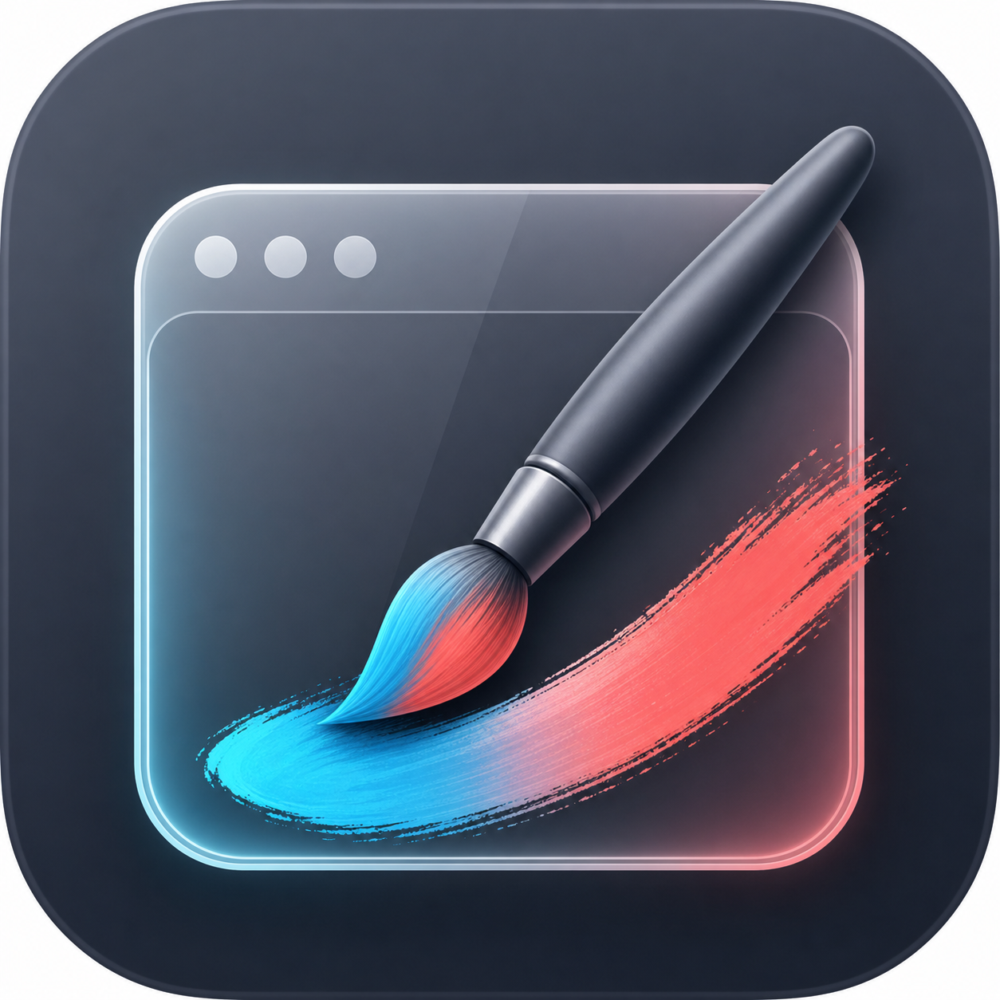

# OverlayBrush

OverlayBrush is a lightweight macOS screen annotation app for demos, teaching, recordings, design reviews, and live presentations. It gives you a transparent drawing layer across your displays so you can mark up anything on screen without switching tools or interrupting your flow.

<p align="center">
  
</p>

## Why OverlayBrush?

Most annotation tools are either tied to a specific meeting app, too heavy for quick demos, or awkward when you need to draw over any app. OverlayBrush is built as a native macOS overlay: open it, draw on top of the screen, then toggle back to click-through mode when you need to interact with the app underneath.

## Features

- Draw anywhere on screen with a transparent overlay
- Freehand pen, arrows, rectangles, and circles
- Floating toolbar with color, tool, and stroke-size controls
- Works across multiple displays
- Toggle between drawing mode and click-through mode
- Undo the last stroke
- Clear the screen quickly
- Native SwiftUI/AppKit macOS app

## Shortcuts

| Shortcut                 | Action                            |
| ------------------------ | --------------------------------- |
| `Option` + `Shift` + `T` | Toggle drawing/click-through mode |
| `Option` + `Z`           | Undo the last stroke              |
| `Delete`                 | Clear all strokes                 |

## Requirements

- macOS 15.5 or later
- Xcode 16.4 or later
- Apple Developer signing identity for local run/release builds

## Getting Started

Clone the project and open it in Xcode:

```sh
git clone https://github.com/<owner>/OverlayBrush.git
cd OverlayBrush
open OverlayBrush.xcodeproj
```

Select the `OverlayBrush` scheme, choose your Apple Development Team under:

`OverlayBrush` target -> `Signing & Capabilities` -> `Team`

Then run the app from Xcode.

## Build From Terminal

For a command-line compile check without code signing:

```sh
xcodebuild \
  -project OverlayBrush.xcodeproj \
  -scheme OverlayBrush \
  -configuration Debug \
  -derivedDataPath ./DerivedData \
  CODE_SIGNING_ALLOWED=NO \
  build
```

For a normal local app run, use Xcode with your own signing team selected.

## Test

Run unit tests from Xcode with `Product -> Test`, or from the terminal:

```sh
xcodebuild \
  -project OverlayBrush.xcodeproj \
  -scheme OverlayBrush \
  -configuration Debug \
  -derivedDataPath ./DerivedData \
  CODE_SIGNING_ALLOWED=NO \
  test \
  -only-testing:OverlayBrushTests
```

Current validation status:

- App build: passing
- Unit tests: passing
- UI automation tests: not included yet

## macOS Permissions

OverlayBrush uses global keyboard monitoring and transparent overlay windows. Depending on your macOS settings and how the app is signed, the system may ask for permissions such as:

- Accessibility
- Input Monitoring
- Screen Recording, if future capture/export features are added

These permissions are controlled by macOS in `System Settings -> Privacy & Security`.

## Release Builds

This repository is source-ready, but public binary releases need proper Apple signing and notarization.

Before shipping a downloadable `.app`, `.zip`, or `.dmg`:

1. Set your Apple Developer Team in Xcode.
2. Archive the `OverlayBrush` scheme.
3. Sign with a Developer ID Application certificate.
4. Notarize the build with Apple.
5. Test the notarized app on a clean macOS user account.

The project intentionally does not include a fixed development team ID so contributors can build with their own Apple account.

## Roadmap

- Better onboarding for macOS permissions
- Menu bar controls
- Configurable shortcuts
- Screenshot/export workflow
- Persistent toolbar placement
- More annotation tools
- Packaged notarized releases

## Contributing

Contributions are welcome. Good first areas to help:

- Polish the toolbar UI
- Improve multi-display behavior
- Add focused tests around drawing state
- Add configurable shortcuts
- Improve release packaging

Please keep changes focused and include a short explanation of the behavior being changed. For UI work, screenshots or short screen recordings are helpful.

## Project Structure

```text
OverlayBrush/
  OverlayBrush.xcodeproj
  OverlayBrush/          App source
  OverlayBrushTests/     Unit tests
  design/                Screenshots and design references
```

## License

OverlayBrush is released under the MIT License. See [LICENSE](LICENSE).
